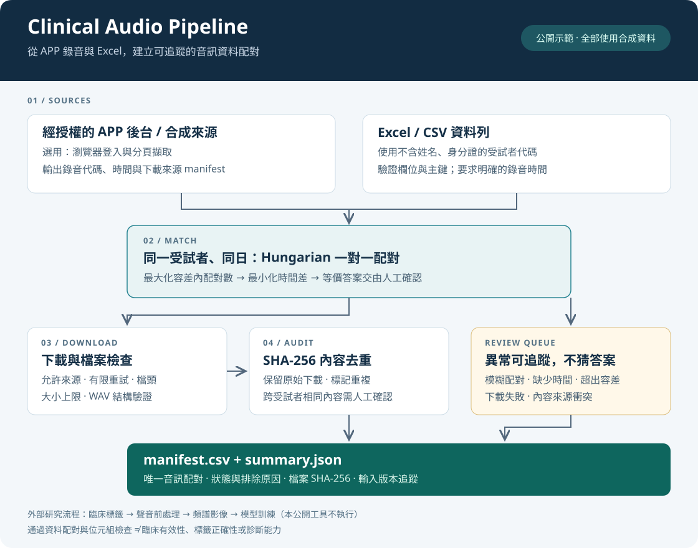
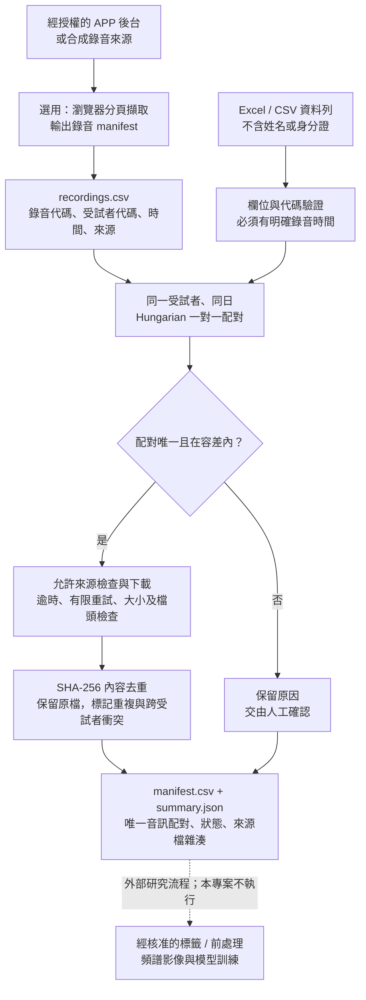

# Clinical Audio Pipeline

### 臨床音訊資料整合：自動下載 × 一對一配對 × 至Excel稽核

[](https://github.com/s960137/clinical-audio-pipeline/actions/workflows/checks.yml)


**把分散在 APP (或蒐集工具)後台與 Excel 的錄音紀錄，整理成可追蹤的「錄音－資料列」配對清單。**

此作品源自氣喘聲音研究的資料準備工作：聲音保存在 APP 的後台，研究所需資訊(姓名與生理資料)會分散在醫院紀錄之表格。下載只是第一步；更重要的是避免重複下載、錯配錄音，以及把同一段聲音當成多筆獨立樣本。

本專案是源自workflow的**獨立公開改寫版**，以合成資料demo核心抓蟲方法，不包含真實病患音檔、Excel、醫院網址、登入狀態或研究歷史。公開版與原始研究程式的差異見 [改寫範圍](docs/provenance.md)。

> Audio acquisition, one-to-one spreadsheet matching and auditable dataset preparation, adapted from a clinical research workflow. The demo uses fictional records and generated tones only. No medical diagnosis, clinical labels or model performance claims are provided.

## 流程圖



圖中的實線是公開版可執行的流程。下游的臨床標籤、聲音前處理、頻譜影像與模型訓練屬於原研究情境，不在這個示範工具內執行。

<details>
<summary>展開可編輯的 Mermaid 流程圖</summary>



</details>

## 解決哪些問題？

| 問題 | 公開版的處理方法 |
|---|---|
| 同一人短時間內有多次錄音，逐列最近時間配對可能重複使用同一筆 | 在同一受試者、同日的候選集合內，容許誤差內一對一配對數，再最小化總時間差 |
| 日期只有「某一天」，或有數個同樣好的data | 日期缺少時間或存在等價最優配對時標記供人工確認 |
| 下載到登入頁、截斷 WAV 或異常檔案 | HTTP 狀態、HTML 類型、檔案大小、音訊標頭與 PCM WAV 結構檢查；驗證後才發布檔案 |
| 不同檔名實際是同一段內容 | SHA-256 比對完整位元組；同受試者保留一筆 eligible，原始下載仍保留 |
| 相同內容出現在不同受試者 | 該重複群全部排除 eligible，標記來源衝突供人工確認 |
| 整理後無法追查 | 每筆保留配對狀態、時間差、下載狀態、內容雜湊與相對路徑；摘要記錄輸入檔 SHA-256 |

`eligible` 只代表通過本工具的配對與位元組檢查，**不代表臨床有效、可直接訓練，或已排除資料洩漏**。

## 五分鐘執行合成示範

需求：Python 3.10 以上。已在 Python 3.11 執行本機驗證；CI 另外在 Windows 與 Ubuntu 執行。

```bash
git clone https://github.com/s960137/clinical-audio-pipeline.git
cd clinical-audio-pipeline
python -m venv .venv
```

啟用虛擬環境：

```powershell
# Windows PowerShell
.\.venv\Scripts\Activate.ps1
```

```bash
# macOS / Linux
source .venv/bin/activate
```

```bash
python -m pip install -e .
python -m clinical_audio_pipeline demo --out demo-output
```

示範會自動產生 **8 筆虛構 Excel 資料列、9 筆錄音來源描述及人工正弦波音檔**，在 `127.0.0.1` 啟動暫時的 HTTP 伺服器，實際走過下載與稽核，再關閉伺服器。安裝完成後，這個示範不需外網、醫院帳號、GPU 或真實錄音。

| 預期摘要 | 數值 |
|---|---:|
| 輸入資料列 | 8 |
| 唯一且在容差內的配對 | 5 |
| 成功取得的有效音檔 | 4 |
| 重複內容群 | 1 |
| 最後 eligible 的唯一配對 | 3 |

其餘案例刻意包含：超過時間容差、日期缺少時間、等價配對，以及假裝是 WAV 的錯誤頁面。這些是**模擬測試，不是研究樣本數或模型成績**。

```text
demo-output/
├── synthetic-inputs/
│   ├── visits.xlsx         # 生成的假 Excel
│   ├── recordings.csv      # 只指向本機暫時伺服器
│   └── R001.wav ...        # 人工產生的測試訊號
└── results/
    ├── manifest.csv        # 所有資料列的配對、下載、去重狀態
    ├── summary.json        # 彙總數量、設定與輸入檔 SHA-256
    └── audios/             # 驗證過的原始位元組及本地快取雜湊
```

輸出目錄已存在時會停止，避免覆蓋舊結果；再次執行請改用 `--out demo-output-2`。合成音訊與計數固定，但 HTTP 暫時連接埠及 XLSX 封裝中繼資料會變動，因此不同次生成的輸入檔雜湊不保證一致。

## 接上自己的授權資料

先在自己的受控環境建立不可直接識別個人的代碼，再準備下列兩份表格。**改成代碼不等於完成匿名化**，資料仍應留在原本受管制的環境。

| 表格 | 必要欄位（不接受額外欄位） |
|---|---|
| `visits.csv` 或 `visits.xlsx` | `row_id`, `subject_id`, `visit_id`, `recorded_at` |
| `recordings.csv` 或 `recordings.xlsx` | `recording_id`, `subject_id`, `recorded_at`, `source_url` |

- `row_id` 與 `recording_id` 在各自表格內必須唯一；`source_url` 不得重複。
- ID 限英文字母開頭、英數字／底線／連字號，最長 64 字元；拒絕臺灣身分證格式。
- 時間格式為 `YYYY-MM-DD HH:MM:SS`，兩份資料需事先對齊同一個本地時區。日期單獨一欄不會被當作精確錄音時間。
- 配對以 `subject_id + 日期` 分組；`visit_id` 僅保留供追蹤。同日多次就診若可能混淆，應先分批提供輸入。本工具不推斷就診事件。
- 固定 schema 不接收姓名、身分證、PEF、人口學欄位或任意額外臨床欄位；此工具只處理資料連結。

```bash
python -m clinical_audio_pipeline run --visits private/visits.xlsx --recordings private/recordings.csv --out outputs/run-001 --allow-host audio.example.invalid --tolerance-seconds 900
```

`example.invalid` 是不可用的示意網域，需要換成你有權限管理存取的實際來源。外部來源必須使用 HTTPS；HTTP 僅允許 loopback 示範。下載不跟隨重新導向，請提供直接音訊 URL。

若來源支援 Bearer token，可從環境變數讀取，並透過 `--token-origin` 指定**唯一允許收到 token 的 HTTPS origin**：

```bash
python -m clinical_audio_pipeline run --visits private/visits.xlsx --recordings private/recordings.csv --out outputs/run-002 --allow-host api.example.invalid --allow-host cdn.example.invalid --token-env AUDIO_API_TOKEN --token-origin https://api.example.invalid
```

環境變數需事先本機設定。Token 不寫入檔案、不放入命令列值，也不會轉送給其他允許下載的網域或不同 port。連線不繼承系統 proxy 或 `.netrc`；需要企業 proxy 的環境必須另外審查配置。

### 選用：瀏覽器擷取 manifest

```bash
python -m pip install -e ".[browser]"
python -m clinical_audio_pipeline collect --config examples/browser_config.json --out private/recordings.csv --browser edge
```

這是**需依網站調整的 adapter**，不是對任意 APP 都能直接用的爬蟲。先在本機的私有設定檔填入授權網址與 CSS selectors，再執行 `collect`；在開啟的瀏覽器自行登入，回到終端機按 Enter。範例 HTML 見 [mock-recordings.html](examples/mock-recordings.html)。

公開版本不包含醫院 DOM、Cookie 匯出、已登入瀏覽器設定檔或繞過存取控制的功能。擷取與下載分開：瀏覽器登入 session 不會自動傳給 HTTP downloader；只支援 Cookie 的後台需另外實作並審查授權 adapter。瀏覽器相容性與真實網站分頁仍需由使用者在有權限的環境驗證；目前自動測試涵蓋核心資料流程，不涵蓋真實網站。

## 測試與公開前檢查

```bash
python -m unittest discover -s tests -v
python tools/audit_public_tree.py
```

測試涵蓋一對一配對的 exhaustive oracle 對照、日期與容差邊界、模糊配對、跨受試者隔離、下載錯誤、快取保護、token origin 綁定、Windows 檔名相容性與合成資料端到端流程。GitHub Actions 在 Windows / Ubuntu 跑相同測試及示範。

公開檢查器檢查 Git index 的檔案型別、大小及部分敏感資訊模式；沒有檢查器能保證找出所有個資或秘密，仍需人工檢查。不要將真實資料加入 staging，也不要把私有研究倉庫的 Git 歷史帶到公開倉庫。詳見 [資料與安全說明](SECURITY.md)。

## 設計限制

- SHA-256 去重只偵測位元組完全相同；重新編碼、裁切或不同格式的同一聲音不會自動合併。
- MP3 / Ogg 只做大小與標頭篩檢；PCM WAV 另檢查結構與資料長度。不是完整音訊解碼或聲音品質判定。
- Downloader 有有限次數的連線與 HTTP 重試；不會無限重試，也不會自動更新過期憑證。每次 pipeline 執行需新輸出目錄；低階下載函式的 verified cache reuse 另有測試，CLI 不提供整批續跑。
- 原檔保留、輸出不覆蓋。檔案發布使用同目錄 hard link，需檔案系統支援（一般 NTFS、ext4 支援）；不支援時停止，不降級成覆寫。
- 本專案**不計算臨床標籤、不推估身高體重、不切分訓練集、不產生頻譜或訓練模型**。資料集仍需額外的臨床與科學審查。

## 作者與使用範圍

作者：[s960137](https://github.com/s960137)。此專案展示研究資料工程與自動化方法，不能用於醫療診斷或治療決策。

目前提供原始碼公開展示，**尚未附加開源授權條款**；公開可見不等於授予任意重用或再散布權利。原研究資料、合作機構資源與第三方服務也不在此專案的授權範圍內。
